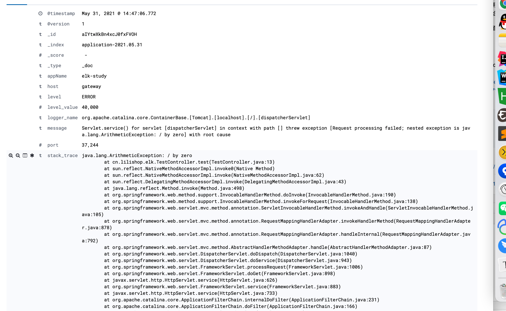

### 本文学习 ELK 日志收集系统


#### ELK介绍
“ELK”是三个开源项目的首字母缩写，这三个项目分别是：Elasticsearch、Logstash 和 Kibana。Elasticsearch 是一个搜索和分析引擎。Logstash 是服务器端数据处理管道，能够同时从多个来源采集数据，转换数据，然后将数据发送到诸如 Elasticsearch 等“存储库”中。Kibana 则可以让用户在 Elasticsearch 中使用图形和图表对数据进行可视化。

#### 负责模块

Elasticsearch：用于 存储、查询 日志信息。

Logstash：用于收集日志，应用整合了Logstash通过配置Logstash的信息，将日志推送给Logstash。

Kibana：Elasticsearch web界面。用于图形操作es中的索引。

#### 使用步骤

1. 启动elk容器，需要用到docker-compose，如果不会安装[点这里](https://docs.pickmall.cn/deploy/%E4%B8%80%E9%94%AE%E9%83%A8%E7%BD%B2.html)，环境安装内容就是了。
```shell
# 跳转项目地址
cd elk
# 启动elk各个容器服务
docker-compose up -d
```


2. 启动springboot应用。

3. 请求springboot 应用   http://127.0.0.1:8080 响应500错误，因为get请求我计算了 1/0 ,抛出异常

4. 请求kibana http://127.0.0.1:5601 查看日志

   


### 开发步骤

1. 配置日志收集 示例如下(此文件为docker容器配置文件，在elk项目根目录 config目录下，同目录还有准备好的ik分词器)

   1. 输入源：接入监听本机logstash
   2. 输出元：接入es，index为索引名称

   ```yml
   input {
     tcp {
       mode => "server"
       host => "127.0.0.1"
       port => 4560
       codec => json_lines
     }
   }
   output {
     elasticsearch {
       hosts => "127.0.0.1:9200"
       index => "application-%{+YYYY.MM.dd}"
     }
   }
   ```

2. springboot项目增加maven依赖
   ```
   <dependency>
       <groupId>net.logstash.logback</groupId>
       <artifactId>logstash-logback-encoder</artifactId>
       <version>6.6</version>
   </dependency>
   ```


3. 配置日志输出，项目resource目录，配置配置文件 logback.xml （src/resource/logback.xml）

   ```xml
   <?xml version="1.0" encoding="UTF-8"?>
   <!DOCTYPE configuration>
   <configuration>
       <include resource="org/springframework/boot/logging/logback/defaults.xml"/>
       <include resource="org/springframework/boot/logging/logback/console-appender.xml"/>
       <!--应用名称-->
       <property name="APP_NAME" value="elk-study"/>
       <contextName>${APP_NAME}</contextName>
   
       <!--输出到elk的LOGSTASH-->
       <appender name="LOGSTASH" class="net.logstash.logback.appender.LogstashTcpSocketAppender">
         <!--配置为 LOGSTASH 地址 -->
           <destination>127.0.0.1:4560</destination>
           <encoder charset="UTF-8" class="net.logstash.logback.encoder.LogstashEncoder">
               <providers>
                   <timestamp>
                       <timeZone>UTC</timeZone>
                   </timestamp>
               </providers>
               <!--自定义字段 区分项目-->
               <customFields>{"appName":"${APP_NAME}"}</customFields>
           </encoder>
       </appender>
     <!-- 日志级别-->
       <root level="INFO">
         <!--输出位置为LOGSTASH-->
           <appender-ref ref="LOGSTASH"/>
       </root>
   </configuration>
   ```

4. 书写一个抛出异常的控制器

   ```java
   @RestController
   public class TestController {
   
       @GetMapping
       public void test() {
   
           //抛出异常
           System.out.println(1 / 0);
       }
   
   }
   ```

